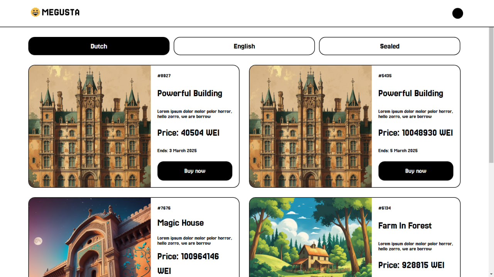

# MEGUSTA: Powerful NFT Auctions Platform

MEGUSTA is a blockchain-based platform designed for creating and managing decentralized NFT auctions. It provides various auction mechanisms to enhance liquidity and accessibility in the NFT market.

## Features
- **Dutch Auctions**: Sellers set a starting price that decreases over time until a buyer accepts.
- **English Auctions**: Buyers place increasing bids until the auction ends, with the highest bidder winning.
- **(Planned) Sealed-Bid Auctions**: Buyers submit hidden bids, and the highest bidder wins after the auction is revealed.
- **NFT Trading**: Users can list, buy, and track their NFT transactions seamlessly.
- **NFT Ownership Display**: A backend API fetches and displays all NFTs owned by a specified address.

## Smart Contracts
### DutchAuctionManager
- Enables the creation of Dutch-style NFT auctions.
- Auctions start at a high price and decrease over time.
- Buyers can purchase an NFT at the current auction price.

### EnglishAuctionManager
- Implements traditional English auctions with open bidding.
- Participants place bids, and the highest bid at the end wins.
- Sellers can accept the highest bid manually or set automatic rules.

### (Planned) SealedBidAuctionManager
- Implements sealed-bid auctions where bids are private until the auction concludes.
- Ensures fairness by keeping bids hidden until the reveal phase.

## Backend
- Provides an API endpoint to fetch all NFTs owned by a given wallet address.
- **Endpoint:** `/get-nfts`
  - **Query Params:** `address`: `account_address`
  - **Response:** List of NFTs owned by the given address.

## Frontend
- Supports creating Dutch auctions.
- Provides NFT trading functionality.
- Displays all NFTs owned by a user.
- Future updates will include support for English and Sealed-Bid auctions.

## Future Plans
- Expand support for English and Sealed-Bid auctions in the frontend.
- Implement additional features such as auction analytics and bidding history.

More details on deployment and usage will be added soon.